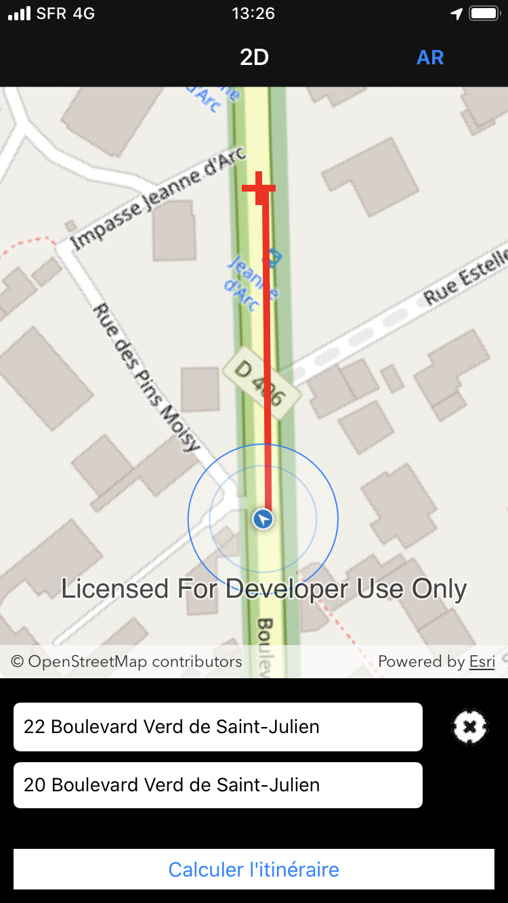
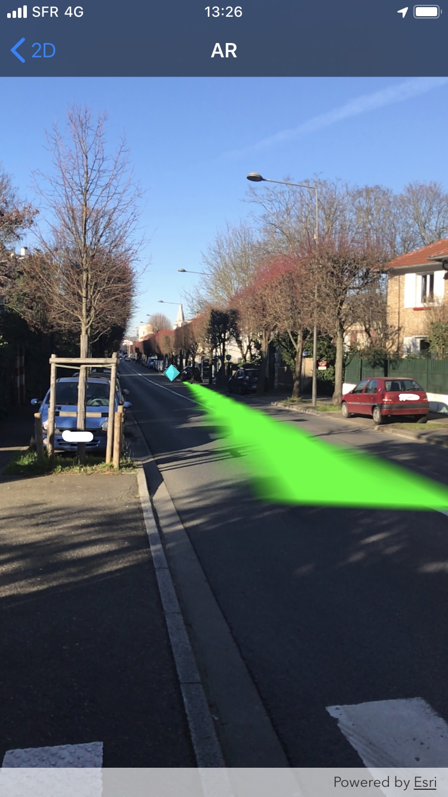

# Augmented Reality routing application with ArcGIS Runtime SDK for iOS 

This is an augmented reality application developed with ArcGIS Runtime SDK for iOS. You can retrieve the get started here: https://developers.arcgis.com/ios/latest/swift/guide/display-scenes-in-augmented-reality.htm


## Installation

### Clone

- Clone this repo to your local machine using `https://github.com/qQsss777/arcgis-sdk-runtime-ARRoute.git`

### Setup
Create an ArcGIS Developer account: https://developers.arcgis.com/.
You need a device which supports ARKit.

After you cloned this repositery, enter:

```shell
$ pod install
```

Then you have to complete some parameters on the MapViewController:

    private var _urlGeocoder:URL = URL(string: "YOUR_URL")!
    private var _urlRoute:URL = URL(string:"YOUR_URL")!
    .
    .
    .
    //Function to validate licence
    private func _validateLicence(){
        
        //Create a View to push your credential and portal adress
        self.portal = AGSPortal(url: URL(string: "YOUR_PORTAL")!, loginRequired: false)
        self.portal.credential = AGSCredential(user: "USERNAME", password: "PASSWORD")
     
     .
     .
     .
   
Then on the ArViewController :

        let elevationSource = AGSArcGISTiledElevationSource(url: URL(string: "YOUR_URL")!)


Now, Debug and enjoy your application.

---

## Use

When you run the application, your device position is on the map.

Before displayAR view, you have to run routing analysis. For this, add a start point (GPS or short tap on the map) and a stop point (long tap on the map). Then, run routing analysis. You can now display your route with AR.

Of course you can adjust color, symbol and positon on the map. Read this page : https://developers.arcgis.com/ios/latest/swift/guide/display-scenes-in-augmented-reality.htm  

 

---

## License

[](https://opensource.org/licenses/Apache-2.0)

